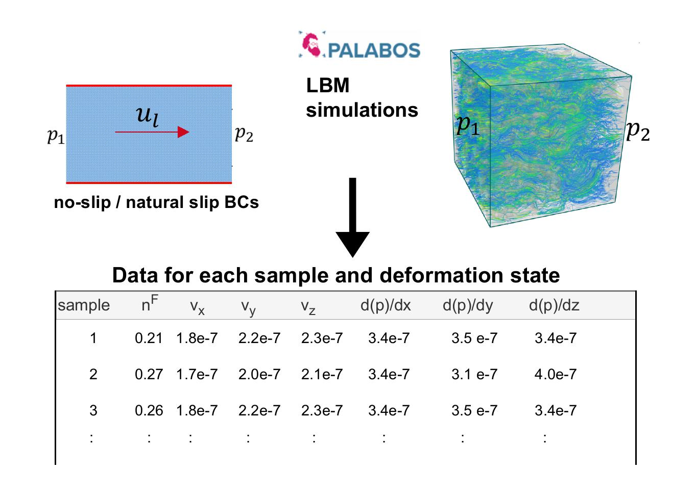
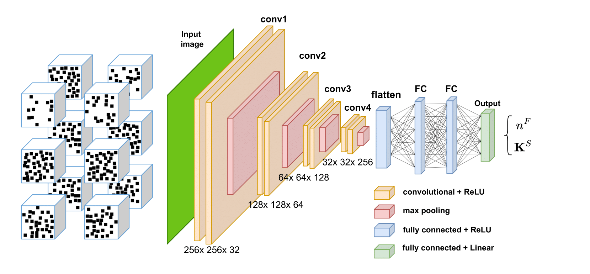
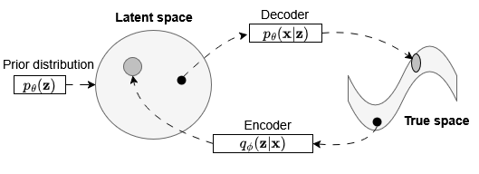

## Property-variational Autoencoder (pVAE) for inverse design

The pVAE framework is trained on two datasets: a synthetic dataset of artificial porous microstructures and CT-scan images of volume elements from real open-cell foams. The encoder-decoder architecture of the VAE captures key microstructural features, mapping them into a compact and interpretable latent space for efficient structure-property exploration. The study provides a detailed analysis and interpretation of the latent space, demonstrating its role in structure-property mapping, interpolation, and inverse design. This approach facilitates the generation of new metamaterials with desired properties

## Design Space Construction

1. Microstructures are represented in voxelized form (binary images).  

2. The effective properties are:  
   - **Porosity** $n^F$  
   - **Intrinsic permeability tensor** $\mathbf{K}^{S}$  

### Porosity
The porosity can be calculated directly from the volume fraction of the pore phase in the binary image:

$$
n^F = \frac{V_\text{pore}}{V_\text{total}}
$$

### Intrinsic Permeability
Estimating the intrinsic permeability tensor $\mathbf{K}^S$ is more challenging and computationally expensive.  

- A **mesh-based approach** can be used from the 3D binary image.  
- The **Lattice Boltzmann Method (LBM)** discretizes the pore space in velocity space and solves the **Navier–Stokes equations** in a stochastic sense with a collision operator.  
- From the LBM, we obtain the microscopic **velocity field** $\mathbf{u}(\mathbf{x})$.  

<p align="center">
  
</p>

The homogenized velocity is computed by volume averaging:

$$
\langle \mathbf{u} \rangle = \frac{1}{V_\text{pore}} \int_{V_\text{pore}} \mathbf{u}(\mathbf{x}) \, dV
$$

Applying **Darcy’s law**, the intrinsic permeability tensor is obtained as:

$$
\langle \mathbf{u} \rangle = -\frac{\mathbf{K}^S}{\mu} \nabla p
$$

where:
- $\mu$ is the dynamic viscosity,
- $\nabla p$ is the macroscopic pressure gradient,
- $\mathbf{K}^S$ is the intrinsic permeability tensor.  

Thus, $\mathbf{K}^S$ can be determined from the relationship between the averaged velocity and the applied pressure gradient.  

---

**Reference:**  
Nguyen Thien Phu, Uwe Navrath, Yousef Heider, Julaluk Carmai, Bernd Markert.  
*Investigating the impact of deformation on foam permeability through CT scans and the Lattice–Boltzmann method*.  
PAMM, 2023. [https://doi.org/10.1002/pamm.202300154]

## A surrogated model: Multiscale CNN-based intrinsic permeability prediction

<p align="center">
  
</p>

**Reference:**  
Yousef Heider, Fadi Aldakheel, Wolfgang Ehlers.
*A multiscale CNN-based intrinsic permeability prediction in deformable porous media*
Applied Sciences, 15(5):2589, 2025.

## Variational autoencoder (VAE)

The Variational Autoencoder (VAE), introduced in 2013, is one of the most influential generative models.  
It combines **deep learning** with **probabilistic inference**, enabling the mapping between high-dimensional data and a structured latent space.  

For more details, see: Kingma & Welling (2013), *Auto-Encoding Variational Bayes*.  

---

### 1. KL Divergence

The **Kullback–Leibler (KL) divergence** measures how one probability distribution differs from another:

$$
D_\text{KL}(p \parallel q) = \sum_{x \in X} p(x) \log \frac{p(x)}{q(x)} = \sum_{x \in X} p(x) \log (p(x)) - \sum_{x \in X} p(x) \log (q(x))
$$

The first term is negative entropy (-H) and the second term is negative cross-entropy (-CE). $D_\text{KL} = CE -H$.

$$
D_\text{KL}(p \parallel q) = - \sum_{x \in X} p(x) \log \frac{q(x)}{p(x)} = - \mathbb{E}_{p} \left[ \log \frac{q(x)}{p(x)} \right] \text{ with } \mathbb{E}(f(x)) = \sum_{x \in X} p(x)f(x)
$$

Jensen inequality:
- $\mathbb{E}[f(x)] \geq f(\mathbb{E}(x)) \rightarrow \text{convex function}$
- $\mathbb{E}[f(x)] \leq f(\mathbb{E}(x)) \rightarrow \text{concave function}$

$$
\- \mathbb{E}_{p} \left[ \log \frac{q(x)}{p(x)} \right] \leq - \log \left[ \mathbb{E}_{p} \left[ \frac{q(x)}{p(x)} \right] \right]
$$

The right side: 

$$
\- \log \left[ \mathbb{E}_{p} \left[ \frac{q(x)}{p(x)} \right] \right] = - \log \left[ \sum_{x} p(x) \left[ \frac{q(x)}{p(x)} \right] \right] = - \log (1) = 0
$$

From that, we have:

$$
D_\text{KL} = - \sum p(x) \log \frac{q(x)}{p(x)} \leq 0 \Rightarrow D_\text{KL} \geq 0
$$

The KL divergence must be equal or larger than zero.

---

### 2. Variational Inference

Bayes theorem:

$$
p(z|x) = \frac{p(x|z)p(z)}{p(x)}
$$

Direct computation of the posterior $p(z|x)$ is often intractable.  
Instead, VAE introduces a **variational distribution** $q_\phi(z|x)$ parameterized by a neural network (the encoder).  

The true log-likelihood is:

$$
\log p_\theta(x) = \log \int p_\theta(x,z)dz = \log \int p_\theta(x|z)p(z)dz
$$

Since this integral is intractable, we approximate it using **variational inference**, where the encoder learns $q_\phi(z|x)$.

---

### 3. Driving the ELBO Loss
A VAE learns stochastic mapping between an observed $\mathbf{x}$-space (true space), whose empirical distribution $q_{\mathcal{D}}(\mathbf{x})$ is typically complicated, and a $\mathbf{z}$-space (latent space), whose distribution can be relatively simple. The generative model learns a joint distribution $p_{\mathbf{\theta}}(\mathbf{x}, \mathbf{z})$ that is often factorized as $p_{\mathbf{\theta}}(\mathbf{x}, \mathbf{z}) = p_{\mathbf{\theta}}(\mathbf{z}) p_{\mathbf{\theta}}(\mathbf{x}|\mathbf{z})$, with a prior distribution over latent space $p_{\mathbf{\theta}}(\mathbf{z})$, a stochastic decoder $p_{\mathbf{\theta}}(\mathbf{x}|\mathbf{z})$. The stochastic encoder $q_{\mathbf{\phi}}(\mathbf{z}|\mathbf{x})$, also called **inference model**, approximates the true but intractable posterior $p_{\mathbf{\theta}}(\mathbf{z}|\mathbf{x})$ of the generative model.

<p align="center">
  
</p>

For any choice of **inference model**, including the choice of variational parameters $\mathbf{\phi}$, we have:

- The log marginal likelihood can be expressed as an expectation
  
$$
\log p_\theta(\mathbf{x}) 
= \mathbb{E}_{q_\phi(\mathbf{z}|\mathbf{x})} \big[ \log p_\theta(\mathbf{x}) \big].
$$

- Since $\log p_{\theta}(\mathbf{x})$ is constant w.r.t. $\mathbf{z}$, we can rewrite

$$
\log p_\theta(\mathbf{x})
= \mathbb{E}_{q_\phi(\mathbf{z}|\mathbf{x})} \left[\log \frac{p_\theta(\mathbf{x}, \mathbf{z})}{p_\theta(\mathbf{z}|\mathbf{x})} \right].
$$

- Add and subtract $\log q_\phi(\mathbf{z}|\mathbf{x})$

$$
\log p_\theta(\mathbf{x}) 
= \mathbb{E}_{q_\phi(\mathbf{z}|\mathbf{x})} \left[ \log \frac{p_\theta(\mathbf{x}, \mathbf{z})}{q_\phi(\mathbf{z}|\mathbf{x})} \right] + \mathbb{E}_{q_\phi(\mathbf{z}\mathbf{x})} \left[ \log \frac{q_\phi(\mathbf{z}|\mathbf{x})}{p_\theta(\mathbf{z}|\mathbf{x})} \right].
$$

- The second term is the KL divergence

$$
D_{\text{KL}}\left(q_\phi(\mathbf{z}|\mathbf{x}) \parallel p_\theta(\mathbf{z}|\mathbf{x})\right) = \mathbb{E}_{q_\phi(\mathbf{z}|\mathbf{x})} \left[ \log \frac{q_\phi(\mathbf{z}|\mathbf{x})}{p_\theta(\mathbf{z}|\mathbf{x})} \right].
$$

Thus:

$$
\log p_\theta(\mathbf{x}) = \underbrace{ \mathbb{E}_{q_\phi(\mathbf{z}|\mathbf{x})} \left[ \log \frac{p_\theta(\mathbf{x}, \mathbf{z})}{q_\phi(\mathbf{z}|\mathbf{x})} \right] }_{\mathcal{L}(\theta,\phi;\mathbf{x})\text{ (ELBO)}} + D_{\text{KL}}\left(q_\phi(\mathbf{z}|\mathbf{x}) \parallel p_\theta(\mathbf{z}|\mathbf{x})\right).
$$

$$
\underbrace{ \mathbb{E}_{q_\phi(\mathbf{z}|\mathbf{x})} \left[ \log \frac{p_\theta(\mathbf{x}, \mathbf{z})}{q_\phi(\mathbf{z}|\mathbf{x})} \right] }_{\mathcal{L}(\theta,\phi;\mathbf{x})\text{ (ELBO)}} = \log p_\theta(\mathbf{x}) - D_{\text{KL}}\left(q_\phi(\mathbf{z}|\mathbf{x}) \parallel p_\theta(\mathbf{z}|\mathbf{x})\right).
$$

We have that the KL divergence must be larger than zero. Then,

$$
\underbrace{ \mathbb{E}_{q_\phi(\mathbf{z}|\mathbf{x})} \left[ \log \frac{p_\theta(\mathbf{x}, \mathbf{z})}{q_\phi(\mathbf{z}|\mathbf{x})} \right] }_{\mathcal{L}(\theta,\phi;\mathbf{x})\text{ (ELBO)}} \leq \log p_\theta(\mathbf{x})
$$

Expanding the joint $p_\theta(\mathbf{x}, \mathbf{z}) = p_\theta(\mathbf{x}|\mathbf{z})p_\theta(\mathbf{z})$, we get:

$$
\mathcal{L}(\theta,\phi;\mathbf{x}) = \mathbb{E}_{q_\phi(\mathbf{z}|\mathbf{x})} \big[ \log \frac{p_\theta(\mathbf{x}|\mathbf{z}) p_\theta(\mathbf{z})}{q_\phi(\mathbf{z}|\mathbf{x})} \big]
$$

$$
\mathcal{L}(\theta,\phi;\mathbf{x}) = \mathbb{E}_{q_\phi(\mathbf{z}|\mathbf{x})} \big[ \log p_\theta(\mathbf{x}|\mathbf{z})\big] + \mathbb{E}_{q_\phi(\mathbf{z}|\mathbf{x})} \big[ \log \frac{p_\theta(\mathbf{z})}{q_\phi(\mathbf{z}|\mathbf{x})} \big]
$$

$$
\mathcal{L}(\theta,\phi;\mathbf{x}) = \underbrace{ \mathbb{E}_{q_\phi(\mathbf{z}|\mathbf{x})} \big[ \log p_\theta(\mathbf{x}|\mathbf{z})\big]}_{\text{Reconstruction loss}} -  \underbrace{ \mathbb{E}_{q_\phi(\mathbf{z}|\mathbf{x})} \big[ \log \frac{q_\phi(\mathbf{z}|\mathbf{x})}{p_\theta(\mathbf{z})} \big]}_{D_\text{KL}\big(q_\phi(z|x) \parallel p(z)\big)}
$$

---

The **Evidence Lower Bound (ELBO)** is maximized to train the VAE:

$$
\log p_\theta(\mathbf{x}) \geq 
\mathbb{E}_{q_\phi(\mathbf{z}|\mathbf{x})}[\log p_\theta(\mathbf{x}|\mathbf{z})] - D_\text{KL}\big(q_\phi(\mathbf{z}|\mathbf{x}) \parallel p(\mathbf{z})\big)
$$

The ELBO has two competing terms:  
- **Reconstruction term**: encourages accurate data reconstruction via the decoder $p_\theta(\mathbf{x}|\mathbf{z})$  
- **Regularization term**: forces $q_\phi(\mathbf{z}|\mathbf{x})$ to be close to the prior $p(\mathbf{z})$  

Thus, the VAE balances reconstruction quality with latent space regularization.

---

### 4. KL Divergence for Standard Normal

When the prior is chosen as $p(\mathbf{z}) = \mathcal{N}(\mu_{p}, {\sigma_{p}}^2)$ and the encoder outputs a Gaussian $q_\phi(\mathbf{z}|\mathbf{x}) = \mathcal{N}(\mu_{q}, {\sigma_{q}}^2)$, the KL divergence has a closed form:

$$
D_\text{KL}\big(\mathcal{N}(\mu_{q}, {\sigma_{q}}^2) \parallel \mathcal{N}(\mu_{p}, {\sigma_{p}}^2)\big)
$$

$$
D_\text{KL}\big(q_\phi(\mathbf{z}|\mathbf{x}) \parallel p(\mathbf{z})\big) = \mathbb{E}_{q_\phi(\mathbf{z}|\mathbf{x})} \big[ \log \frac{q_\phi(\mathbf{z}|\mathbf{x})}{p(\mathbf{z})} \big]
$$

Given a dataset with i.i.d data (discete variable):

$$
D_\text{KL}\big(q_\phi(\mathbf{z}|\mathbf{x}) \parallel p(\mathbf{z})\big) = \sum_{\mathbf{x} \in \mathbb{D}} \frac{1}{\sqrt{2\pi{\sigma_q}^2}} e^{-\frac{1}{2}{\left( \frac{\mathbf{x} - \mu_q}{\sigma_q} \right)}^2} \log \left[ \frac{ \frac{1}{\sqrt{2\pi{\sigma_q}^2}} e^{-\frac{1}{2}{\left( \frac{\mathbf{x} - \mu_q}{\sigma_q} \right)}^2}}{ \frac{1}{\sqrt{2\pi{\sigma_p}^2}} e^{-\frac{1}{2}{\left( \frac{x - \mu_p}{\sigma_p} \right)}^2}} \right]
$$

$$
D_\text{KL}\left(q_\phi(\mathbf{z}|\mathbf{x}) \parallel p(\mathbf{z})\right) = \sum_{\mathbf{x} \in \mathbb{D}} \frac{1}{\sqrt{2\pi{\sigma_q}^2}} e^{-\frac{1}{2}{\left( \frac{\mathbf{x} - \mu_q}{\sigma_q} \right)}^2} \left( \log \frac{\sigma_p}{\sigma_q} - \frac{(\mathbf{x}-\mu_q)^2}{2{\sigma_q}^2} + \frac{(\mathbf{x}-\{\mu_p})^2}{2{\sigma_p}^2} \right)
$$

We have the Gaussian kernel at the begining.

$$
D_\text{KL} = \mathbb{E}_q \left( \log \frac{\sigma_p}{\sigma_q} - \frac{(\mathbf{x}-\mu_q)^2}{2{\sigma_q}^2} + \frac{(\mathbf{x}-\{\mu_p})^2}{2{\sigma_p}^2} \right)
$$

$$
D_\text{KL} = \log \frac{\sigma_p}{\sigma_q} - \frac{\mathbb{E}_q \left[ (\mathbf{x}-\mu_q)^2 \right]}{2{\sigma_q}^2} + \frac{\mathbb{E}_q \left[ (\mathbf{x}-\{\mu_p})^2 \right]}{2{\sigma_p}^2} 
$$

$$
D_\text{KL} = \log \frac{\sigma_p}{\sigma_q} - \frac{1}{2} + \frac{1}{2{\sigma_p}^2} \mathbb{E}_q \left[ (\mathbf{x}-\{\mu_p})^2 \right] 
$$

$$
D_\text{KL} = \log \frac{\sigma_p}{\sigma_q} - \frac{1}{2} + \frac{1}{2{\sigma_p}^2} \left[\mathbb{E}_q [{\underbrace{(\mathbf{x}-\{\mu_q})^2}_{{\sigma_q}^2}}]  + 2(\mu_q - \mu_p){\underbrace{\mathbb{E}_q \left[ \mathbf{x} - \mu_q \right]}_{0}} + (\mu_q - \mu_p)^2 \right]
$$

$$
D_\text{KL} = \log \frac{\sigma_p}{\sigma_q} - \frac{1}{2} + \frac{{\sigma_q}^2 + (\mu_q - \mu_p)^2}{2{\sigma_p}^2}
$$

With the prior as **Standard normal**, $p_{\mathbf{z}}$ \sim \mathcal{N} (\mu_p = 0, {\sigma_p}^2 = 1)

$$
D_\text{KL} = \log \frac{1}{\sigma_q} - \frac{1}{2} + \frac{{\sigma_q}^2+ {\mu_q}^2}{2}
$$

$$
D_\text{KL} = \frac{1}{2} \left[ \log \frac{1}{{\sigma_q}^2} -1 + {\sigma_q}^2+ {\mu_q}^2 \right] 
$$

This term is added to the reconstruction loss to form the full VAE objective.

---

## Copyright

 © Prof. Dr.-Ing. habil. Fadi Aldakheel

 Leibniz Universität Hannover 

 Faculty of Civil Engineering and Geodetic Science 

 Institut für Baumechanik und Numerische Mechanik (IBNM)

 https://www.ibnm.uni-hannover.de
 
 Coded by Phu Thien Nguyen with the help of Copilot :smiley:

 Paper: Deep learning-aided inverse design of porous metamaterials
 The authors are:
 Phu Thien Nguyen, Yousef Heider, Dennis Kochmann, Fadi Aldakheel

## Project Structure

```
vae-3d-bmp
├── src
│   ├── model.py           # Defines the VAE architecture
│   ├── train.py           # Contains the training loop for the VAE
│   ├── train_vae_tune.py  # Contains the ray tune framework for hyperparameter tuning
│   ├── evaluate.py        # Evaluates the performance of the trained VAE
│   ├── latent_extract.py  # Extract the latent space
│   ├── interpolation.py   # The sphearical interpolation (Slerp)
│   ├── inverse.py         # Inverse process with target properties
│   └── utils
│       └── data_loader.py # Utility functions for loading and preprocessing data
├── data
│   ├── data3D200          # Directory containing 3D BMP images ($200^3$) (email me: phu.thien.nguyen@irtg2657.uni-hannover.de)
│   ├── data3D200.csv      # Effective Properties for 3D BMP images ($200^3$)
│   ├── syn-data.ipynb     # Notebook for creating synthetic data ($100^3$), random pore position is uniform distribution
├── requirements.txt       # Lists the required Python dependencies and data information
├── .gitignore             # Specifies files to be ignored by Git
└── README.md              # Documentation for the project
```

## Setup Instructions

1. Clone the repository:
   ```
   git clone <repository-url>
   cd vae-3d-bmp
   ```

2. Install the required dependencies:
   ```
   pip install -r requirements.txt
   ```

3. Place your 3D BMP images in the `data3d` directory.

## Usage

To train the VAE, run the following command:
```
python src/train.py
```

After training, you can evaluate the model using:
```
python src/evaluate.py
```

## Model Overview

The pVAE consists of a variational autoencoder (VAE) and a regressor. The VAE includes an encoder that compresses input images into a latent space and a decoder that reconstructs images from this latent representation. In addition to minimizing the reconstruction loss and the Kullback-Leibler divergence, the latent space is used by a regressor to predict effective material properties directly from the encoded representations. This joint framework enables both image reconstruction and property prediction, facilitating structure-property mapping and inverse design.

**Reference:**  
[1]. P.T. Nguyen, Y. Heider, D. Kochmann, and F. Aldakheel, Deep learning-aided inverse design of porous metamaterials, CMAME, (2025)

[2]. P.T. Nguyen, B.-e. Ayouch, Y. Heider, and F. Aldakheel, Impact of Dataset Size and Hyperparameters Tuning in a VAE for Structure-Property Mapping in Porous Metamaterials, PAMM, (2025)

## License

This project is licensed under the MIT License. See the LICENSE file for more details.
